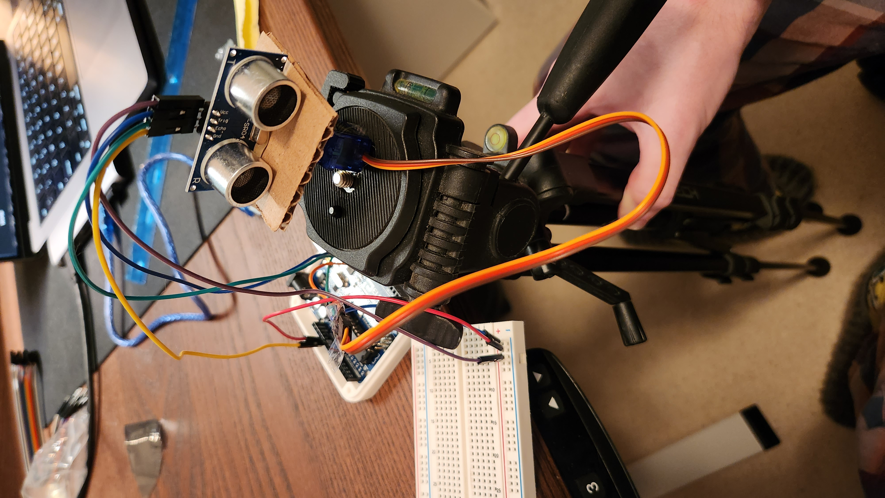
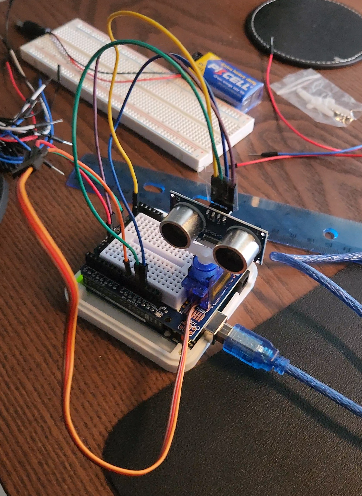
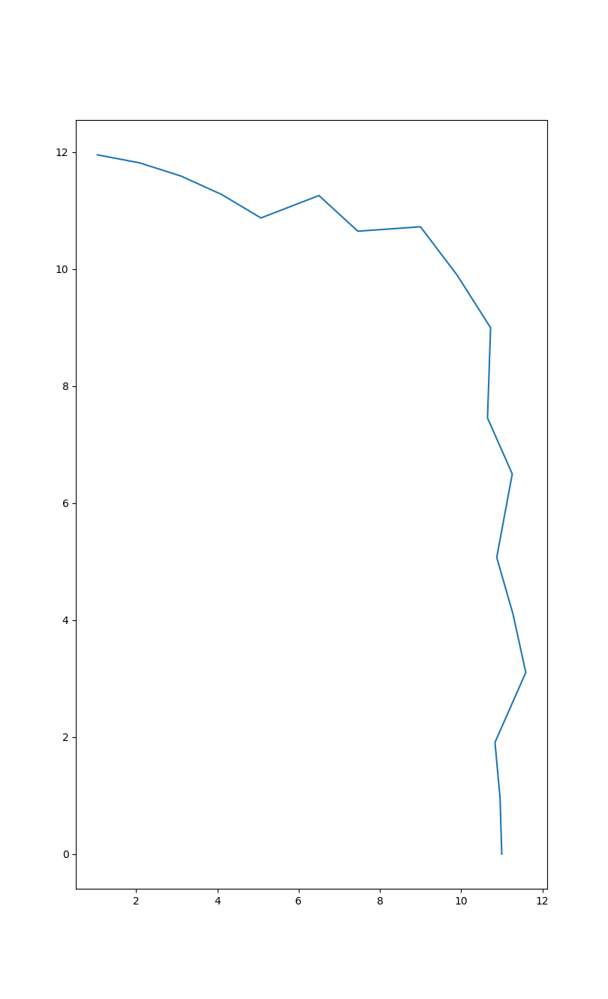
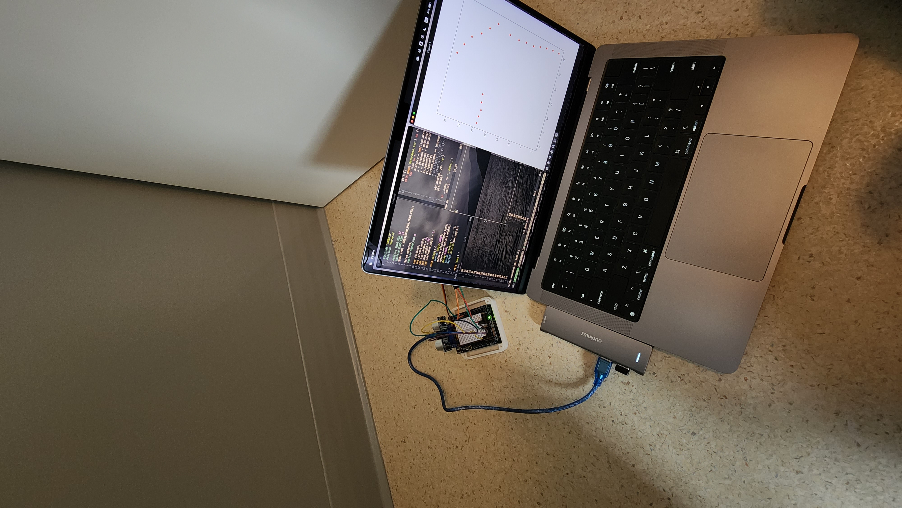

# ultrasonic-mapper

I wanted to do a small personal project to explore my Arduino kit and some basics. After some thinking, I decided to make a environment mapper with the Ultrasonic sensor (HC-SR04).

The idea is pretty simple, I would mount the sensor on top of a servo motor and rotate it degree by degree to get the distance between a objects/walls/etc and the sensor. I would then make a Python script to calculate the $x$ axis and the $y$ axis with the [Pythagorean trigonometric identity](https://en.wikipedia.org/wiki/Pythagorean_trigonometric_identity) to show the map in a plot using matplotlib.

## Process

### First version

In the first version, I hot glued the servo motor to my tripod and did the same thing for the sensor on a piece of cardboard.

It quickly became annoying to move the setup arround so I decided to make a second version.

### Second version

I redid the wiring and remove the card board and the tripod (cause there was no use for it). I based my design on this [project](https://www.hackster.io/Satyavrat/ultrasonic-map-maker-using-an-arduino-yun-37c72e?ref=explore&amp;ref_id=trending___&amp;offset=25) since we wanted to do the same thing.

### Scanning

When the setup was done, I continued the code I had to test the sensor and the servo. When the code was done, I began testing the scanning in corners, I quickly realized that the scanner wasn't doing great when the surface was in angle. 

(That's supposed to be a $90\degree$ corner.)

When the wall was in an angle, the signal didn't bounce back to the sensor, or it was bouncing back from a closer/further surface.

As you can see, the graph on my screen is not accurate in the corner part of the wall, the rest is fine.
